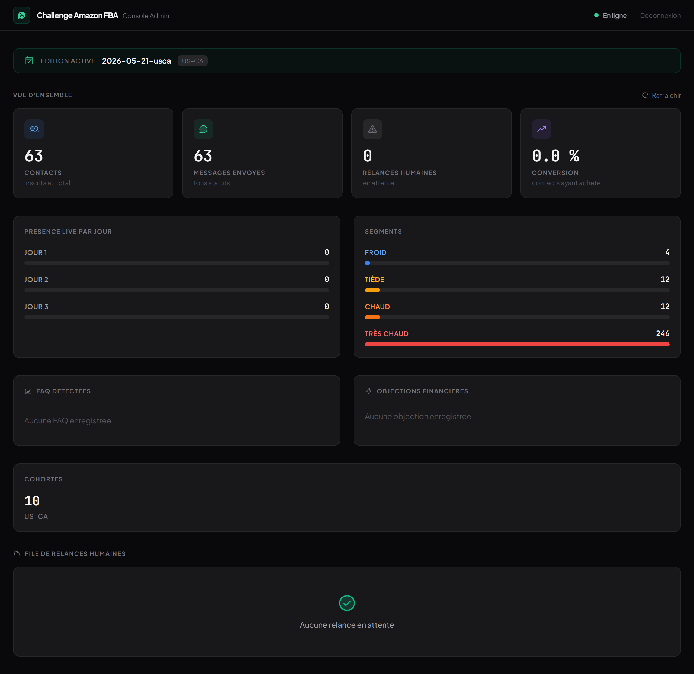
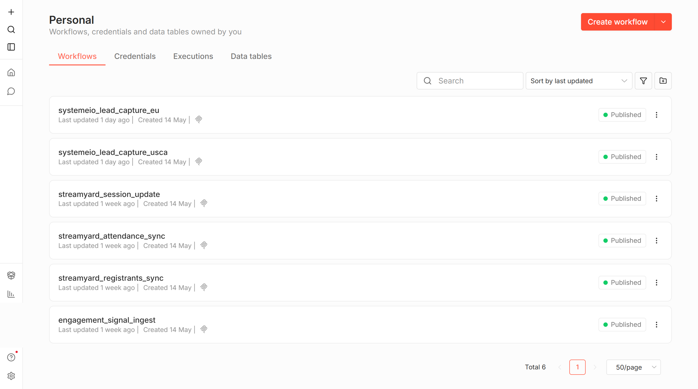
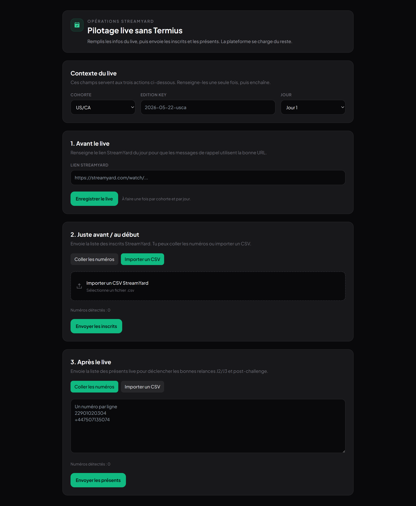

# Challenge Amazon FBA - WhatsApp Automation Platform

> Portfolio-grade case study + production-ready implementation.
>
> FR + EN documentation in one README.



## FR - Presentation

Ce projet automatise un challenge live (3 jours) en s'appuyant sur WhatsApp :

- acquisition des leads via Systeme.io
- orchestration via n8n
- envoi et reception WhatsApp via Wati (WhatsApp Business)
- segmentation comportementale (presence live / inscription StreamYard / absence)
- relances J1/J2/J3 + post-challenge
- arret automatique des relances apres achat
- portail operateur "PILOTAGE LIVE" pour gerer StreamYard sans Termius / curl

Le but : augmenter le taux de presence aux lives et convertir sans surcharge humaine.

### Captures





## FR - Architecture

```mermaid
flowchart LR
  A[Systeme.io<br/>Funnels EU / US-CA] -->|Webhook opt-in| B[n8n]
  B -->|Normalize + Forward| C[Platform API]
  C --> D[(PostgreSQL)]
  C --> E[(Redis)]
  C -->|Send template| F[Wati / WhatsApp Business]
  F -->|Inbound webhooks| C

  G[StreamYard] -->|Operator inputs (URL, registrants, attendance)| H[PILOTAGE LIVE Portal]
  H -->|Ops endpoints| C
```

### Modules (vue simple)

- `services/integrations`: webhooks Systeme.io + StreamYard, normalisation des payloads.
- `services/campaigns`: logiques de journey (J-6 -> J1 -> J2 -> J3 -> post), branching, planification.
- `services/messaging`: provider Wati + persistance des messages.
- `apps/admin-console`: console admin + portail `PILOTAGE LIVE`.

## FR - Parcours metier (de A a Z)

1. Un lead s'inscrit via le funnel Systeme.io (EU ou US-CA).
2. Systeme.io declenche un webhook -> n8n -> API.
3. La plateforme cree/met a jour le contact, applique la cohorte, cree l'enrollment.
4. La plateforme envoie le 1er message `welcome` via Wati.
5. La sequence de messages continue selon la timeline.
6. Autour des lives, l'operateur renseigne StreamYard via `PILOTAGE LIVE` :
   - lien du live du jour
   - inscrits StreamYard
   - presents live
7. La plateforme enregistre les evenements et applique les branches :
   - present
   - inscrit absent
   - non inscrit
8. Si achat detecte (`paid_offer`), arret automatique des broadcasts sur ce contact.

## FR - Exploitation (sans intervention technique)

Le mode operatoire complet est ici :

- `platform/docs/finalisation-projet/MODE-OPERATOIRE-FINAL-CHALLENGE-AMAZON-FBA.md`

En bref, l'utilisateur final fait seulement :

- lire/repondre aux messages dans Wati (ou app Wati avec notifications)
- utiliser `PILOTAGE LIVE` avant / pendant / apres chaque live

## FR - Deploiement / Configuration

Runbook de deploiement (VPS + Coolify) :

- `platform/docs/runbooks/deployment.md`

Secrets principaux (exemples) :

- `POSTGRES_DSN`
- `REDIS_URL`
- `WATI_API_URL` (ex: `https://eu-api.wati.io/<TENANT_ID>`)
- `WATI_API_TOKEN`
- `OPS_PORTAL_TOKEN` (token du portail `PILOTAGE LIVE`)

Note : ne jamais commiter de secrets. Utiliser uniquement Coolify / variables d'environnement.

## FR - Points d'engineering notables

- Normalisation robuste des payloads Systeme.io (y compris forwarding via n8n).
- Branching 3 voies sur J2/J3 + post-live (attended / registered_absent / not_registered).
- Alignement strict code <-> noms de templates Wati (evite les mismatch en prod).
- Portail operateur tokenise pour StreamYard, mobile-friendly, sans dependance SSH.

---

## EN - Overview

This repository is a production-grade WhatsApp automation platform designed for a 3-day live challenge funnel:

- lead capture from Systeme.io
- workflow orchestration via n8n
- WhatsApp messaging via Wati (WhatsApp Business)
- behavior-based segmentation (attended / registered-absent / not-registered)
- J1/J2/J3 reminders + post-challenge follow-ups
- automatic stop after purchase
- operator portal "PILOTAGE LIVE" to handle StreamYard without SSH/curl

Goal: improve live attendance and conversions while reducing manual workload.

## EN - End-to-end Flow

1. Lead opts-in on a Systeme.io funnel (EU or US-CA).
2. Systeme.io webhook -> n8n -> Platform API.
3. Platform creates/updates contact, assigns cohort, creates enrollment.
4. Platform sends `welcome` template via Wati.
5. Journey continues according to the campaign schedule.
6. Around each live session, operator uses `PILOTAGE LIVE` to submit:
   - live URL (per day)
   - registrants
   - attendees
7. Platform records events and applies branching for day 2/3 and post-live.
8. When a purchase is detected (`paid_offer`), broadcasts stop for that contact.

## EN - Ops / Runbooks

- Final operator guide (FR): `platform/docs/finalisation-projet/MODE-OPERATOIRE-FINAL-CHALLENGE-AMAZON-FBA.md`
- Deployment runbook: `platform/docs/runbooks/deployment.md`

## Repo Notes

This repo contains both engineering deliverables (services, tests, admin console) and client-facing artifacts under `platform/docs/`.

